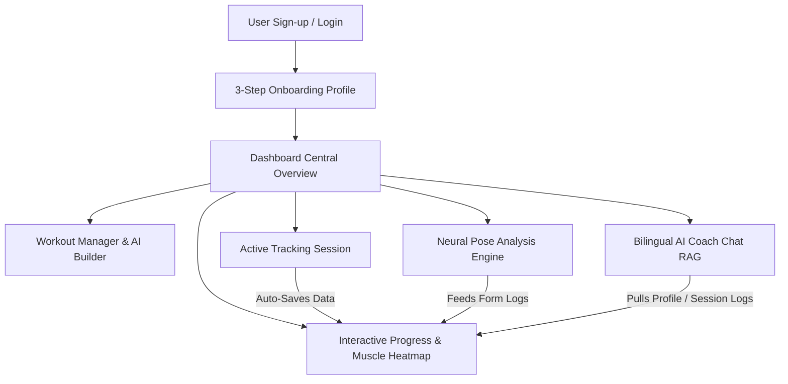
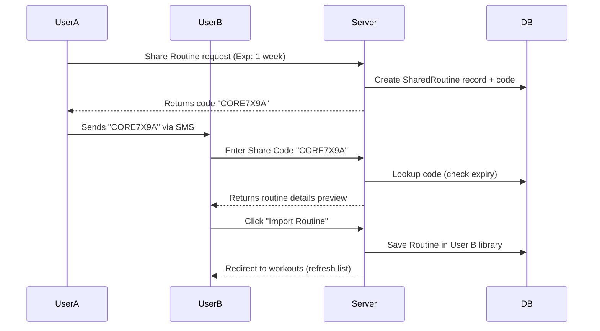

# Core-360: Comprehensive Features & System Architecture Specification
> **Draft Date:** May 25, 2026  
> **Purpose:** Detailed functional audit and technical blueprint to translate the Core-360 Next.js web application into a premium, state-of-the-art mobile application (iOS/Android).

---

## 1. Executive Summary

**Core-360** is a premium, AI-driven performance coaching and fitness tracking application. It bridges the gap between conventional workout trackers and active personal trainers by combining standard workout logging with **real-time computer-vision form analysis** and a **bilingual RAG (Retrieval-Augmented Generation) AI Coach**. 

### Core Tech Stack (Web)
* **Framework:** Next.js (React 19, Server Actions, Dynamic API Routing)
* **Database & ORM:** PostgreSQL + Prisma ORM
* **Authentication:** NextAuth.js / Auth.ts
* **Computer Vision:** MediaPipe Pose Landmark Detection (Webcam/Static Image)
* **LLM Engine:** Groq Cloud SDK (Llama-3.3-70b-versatile)
* **Styling & Visualization:** TailwindCSS, Recharts, `react-body-highlighter`

---

## 2. Interactive Feature Architecture & User Flows

The Core-360 experience is split into six interactive functional pillars, detailed below with their respective workflows, business rules, and UI expectations.



---

### Feature Area 1: User Onboarding & Identity Management
Allows users to securely register, verify their identities, and capture biometric profiles to dynamically customize the AI's recommendations.

#### Functional Specifications
* **Standard Authentication:** Secure sign-up and login with email and hashed passwords.
* **Onboarding Biometric Survey:** A guided 3-Step modal that is triggered upon first-time login:
  * **Step 1 (Basic Biometrics - Required):** Age (10-120), Height in cm (100-250), and Weight in kg (30-300) with strict Zod validation.
  * **Step 2 (Advanced Metrics - Optional):** Body Fat %, Water Percentage %, Muscle Mass in kg (can be skipped).
  * **Step 3 (Goals & Injuries - Required):** Multi-selection of primary goals (*Muscle Gain, Weight Loss, Posture Correction, Flexibility, Endurance*) and a free-text input for *Pre-Existing Injuries* (critical for AI safety).
* **Multi-Factor & Biometric Assets:** Placeholders in the database for `faceDescriptor` (facial recognition check-in) and `isTwoFactorEnabled` with phone number integration for SMS codes.

---

### Feature Area 2: Workout Routine Builder & Social Sharing
Provides a sandbox for designing routines manually or dynamically compiling them using AI, along with peer-to-peer sharing capabilities.

#### Functional Specifications
* **Manual Workout Builder:** Allows users to name routines, search the system's global exercise library, arrange exercises in chronological order, and configure individual sets (defining default reps and weight in kilograms).
* **AI Workout Planner Survey:** A 4-step wizard that asks the user for their experience level, weekly training frequency, and split focus (*Full Body, Upper Body, Lower Body, Push, Pull, Core & Cardio*).
  * **AI Generation Endpoint:** Queries Llama-3.3-70b-versatile, merging survey responses with the user's active Profile. The AI designs a personalized 4-6 exercise routine, calculating recommended set weights dynamically based on user experience and body weight, while explicitly avoiding movements that stress reported injury areas.
* **Instant Social Sharing:** Generates a unique, randomized, 8-character uppercase share code (e.g., `CORE7X9A`) with configurable expiration periods (*1 Day, 1 Week, or Never*).
* **Routine Importing:** Users input a peer's share code to fetch routine details. The system displays a preview card listing all exercises, which the user can save to their library with a custom name.



---

### Feature Area 3: Active Workout Tracking Session
Tracks real-time user performance during a workout session, allowing them to record actual sets, reps, and weights.

#### Functional Specifications
* **Active Stopwatch HUD:** An active timer at the top of the screen that tracks the elapsed workout duration in `MM:SS` from the session's exact start time.
* **Instructional Video Player:** Embeds exercise tutorial videos dynamically by converting standard YouTube watch links into iframe-embed URLs.
* **Interactive Sets Ledger:**
  * Displays exercises sequentially with a glowing progressive indicator bar.
  * Allows users to dynamically add sets, delete sets, adjust weights (+/- 2.5kg buttons), and adjust reps (+/- 1 rep buttons).
  * Supports marking individual exercises as completed (`Done`) or skipped (`Skip`).
* **Trophy Reward Card:** Triggers a post-workout summary screen upon completion showing a glowing gold trophy, the calculated total elapsed time, the count of completed exercises, and a quick link to the analytical progress page.

---

### Feature Area 4: Neural Pose Analysis Engine (Computer Vision)
An advanced computer-vision interface that detects the user's posture, evaluates joint angles, and provides real-time biomechanical analysis.

#### Functional Specifications
* **Dual Capture Modes:**
  * **Live Camera Mode:** Uses the device's front or back camera to analyze live movement frames.
  * **Static Image Upload:** Allows users to drop/upload a static photo of a pose.
* **Geometric Biomechanics Module:** Measures specific vector angles in real-time from MediaPipe landmark arrays:
  * *Left/Right Elbows* (Shoulder-Elbow-Wrist angle)
  * *Left/Right Knees* (Hip-Knee-Ankle angle)
  * *Left/Right Hips* (Shoulder-Hip-Knee angle)
  * *Back Alignment* (Nose-Hip-Knee angle to evaluate forward lean)
* **Geometric Posture Score (0-100%):** Calculates a live mechanical score based on ideal angles (e.g., knee flex depth under 100° for deep squats, back straightness between 160-180°).
* **Live HUD Warning Strip:** Displays real-time corrective status:
  * **Form Looks Good (Score >= 70%):** Displays a green checkmark indicating safe tracking.
  * **Form Correction Needed (Score < 70%):** Displays a red alert warning the user of potential issues (e.g., *"Squat depth is shallow or back is leaning forward. Lower hips and keep chest upright"*).
* **AI Biomechanics Report:** Calls the server API to stream a detailed posture evaluation. The AI analyzes joint angle numbers, checks for pre-existing injuries, and outputs:
  1. **Injury Alerts:** Positioned at the very top if the exercise threatens a pre-existing injury.
  2. **Overall Accuracy:** A formal score parsed by the frontend to update charts.
  3. **Joint Analysis:** A line-by-line breakdown (Good ✅ / Warning ⚠️ / Critical 🚨).
  4. **Key Corrections:** Actionable coaching tips.
  5. **Injury Risk Assessments:** Identifying high-stress areas.
  6. **Alternative Exercises:** Recommending safer alternatives tailored to the user's injuries.

---

### Feature Area 5: Bilingual RAG AI Coach (Interactive Assistant)
A conversational AI assistant that acts as a 24/7 personal trainer, equipped with full knowledge of the user's training history and safety alerts.

#### Functional Specifications
* **Automatic Language Detection:** Seamlessly detects English or Arabic (Egyptian slang) input and enforces that language for the entire conversation.
* **Retrieval-Augmented Context (RAG):** Every message sent to the AI is augmented with a rich context payload fetched directly from the database:
  * Current date and time.
  * User biometrics, fitness goals, and active injuries.
  * Saved routines in their library.
  * Recent workout performance details (the last 3 sessions, including logged weights and reps).
  * Historical AI pose analysis scores.
  * Unresolved active safety alerts or form errors.
  * Today's scheduled AI workout plan.
* **Injury Safeguarding:** If a user requests a routine or exercise that conflicts with an active injury alert, the AI Coach is programmed to reject the request with a warning.
* **Interactive Plan Proposals:** When the user types commands like *"Give me a workout"* or *"Suggest a warm-up"*, the AI streams a special JSON structure wrapped in custom tags:
  ```
  [PLAN_PROPOSAL]
  {
    "exercises": [
      {"name": "Push-Ups", "key": "push_ups", "sets": "3x12", "status": "upcoming"}
    ]
  }
  [/PLAN_PROPOSAL]
  ```
  The chat interface parses this JSON block to render interactive, clickable cards inside the chat bubble, allowing the user to save the plan directly to their workouts.

---

### Feature Area 6: Interactive Analytics & Progress Dashboard
Visualizes historical performance, session frequencies, and muscle activation densities.

#### Functional Specifications
* **Time-Window Selectors:** Toggle metrics between a **7-Day** or **30-Day** rolling window.
* **Analytical KPI Blocks:** Displays four cards:
  1. *Sessions Completed* (with a time-period label).
  2. *Total Volume* (sum of all sets logged).
  3. *AI Analyses* (total MediaPipe pose runs).
  4. *Average AI Accuracy* (color-coded: Green >= 75%, Amber >= 50%, Red < 50%).
* **Performance Trends Line Chart:** Area charts comparing **Form Accuracy %** (green) against **Injury Risk %** (red) over the selected time window.
* **Weekly Session Frequency Chart:** Bar charts plotting workout count frequencies.
* **Anatomical Muscle Highlighter Map:**
  * Integrates an interactive human muscle model with **Anterior (front)** and **Posterior (back)** toggle views.
  * **Trained Muscle Heatmap:** Highlights muscle groups using a 3-level green gradient based on target muscle frequencies in logged workouts.
  * **Interactive Muscle Tooltip:** Hovering over or clicking a muscle highlights that group and overlays a floating card listing the **Top 3 Exercises** logged for that muscle, complete with total sets and average lifted weight.

---

## 3. Database Schema (Source of Truth)

To ensure the mobile database (whether Local SQLite, WatermelonDB, or a PostgreSQL endpoint) matches the core structure, here is the official Prisma Schema definition:

```prisma
// ─── User Profile & Settings ──────────────────────────────────────────────────
model User {
  id                 String   @id @default(cuid())
  email              String   @unique
  password           String
  name               String?
  image              String?
  faceDescriptor     String?  @db.Text
  createdAt          DateTime @default(now())
  updatedAt          DateTime @updatedAt
  settings           Json     @default("{}")
  phoneNumber        String?
  isTwoFactorEnabled Boolean  @default(false)

  // Relations
  chats               Chat[]
  profile             UserProfile?
  analysisResults     AnalysisResult[]
  alerts              Alert[]
  progress            Progress[]
  aiAnalysisSessions  AIAnalysisSession[]
  routines            Routine[]
  sessions            Session[]
  aiPlans             AIPlan[]
}

model UserProfile {
  id              String   @id @default(cuid())
  userId          String   @unique
  user            User     @relation(fields: [userId], references: [id], onDelete: Cascade)
  age             Int
  height          Float
  weight          Float
  bodyFat         Float?
  waterPercentage Float?
  muscleMass      Float?
  goals           String[]
  injuries        String?
  createdAt       DateTime @default(now())
  updatedAt       DateTime @updatedAt
}

// ─── Workout Library & Routines ────────────────────────────────────────────────
enum TargetMuscle {
  chest
  trapezius
  upper_back
  lower_back
  biceps
  triceps
  forearm
  front_deltoids
  back_deltoids
  abs
  obliques
  quadriceps
  hamstring
  adductor
  abductors
  calves
  gluteal
}

model Workout {
  id           String       @id @default(uuid())
  title        String
  description  String?
  targetMuscle TargetMuscle
  thumbnailUrl String?
  videoUrl     String?
  aiSupported  Boolean      @default(false)
  createdAt    DateTime     @default(now())

  routineItems     RoutineExercise[]
  sessionExercises SessionExercise[]
  formAccuracies   FormAccuracy[]
}

model Routine {
  id            String   @id @default(uuid())
  userId        String
  user          User     @relation(fields: [userId], references: [id])
  name          String
  shareCode     String   @unique @default(uuid())
  isAiGenerated Boolean  @default(false)
  createdAt     DateTime @default(now())

  exercises RoutineExercise[]
  sessions  Session[]
}

model RoutineExercise {
  id        String  @id @default(uuid())
  routineId String
  routine   Routine @relation(fields: [routineId], references: [id], onDelete: Cascade)
  workoutId String
  workout   Workout @relation(fields: [workoutId], references: [id])
  sets      Json    // Array of { reps: number, kg: number }
  order     Int
}

// ─── Active Training Sessions ───────────────────────────────────────────────
enum SessionStatus {
  ACTIVE
  COMPLETED
  ABANDONED
}

model Session {
  id          String        @id @default(cuid())
  userId      String
  user        User          @relation(fields: [userId], references: [id])
  routineId   String?
  routine     Routine?      @relation(fields: [routineId], references: [id])
  startTime   DateTime      @default(now())
  endTime     DateTime?
  durationSec Int?
  status      SessionStatus @default(ACTIVE)
  createdAt   DateTime      @default(now())
  updatedAt   DateTime      @updatedAt

  exercises      SessionExercise[]
  formAccuracies FormAccuracy[]
}

model SessionExercise {
  id          String   @id @default(cuid())
  sessionId   String
  session     Session  @relation(fields: [sessionId], references: [id], onDelete: Cascade)
  workoutId   String
  workout     Workout  @relation(fields: [workoutId], references: [id])
  isSkipped   Boolean  @default(false)
  actualSets  Json?    // Array of recorded { reps: number, kg: number }
  completedAt DateTime?
  order       Int

  @@unique([sessionId, workoutId])
}

// ─── AI Pose Analysis & Safety RAG ───────────────────────────────────────────
model AIAnalysisSession {
  id            String   @id @default(cuid())
  userId        String
  user          User     @relation(fields: [userId], references: [id], onDelete: Cascade)
  exerciseName  String
  targetMuscle  String?
  accuracyScore Float
  reportText    String?  @db.Text
  createdAt     DateTime @default(now())
}

model FormAccuracy {
  id            String   @id @default(cuid())
  sessionId     String
  session       Session  @relation(fields: [sessionId], references: [id], onDelete: Cascade)
  exerciseId    String
  workout       Workout  @relation(fields: [exerciseId], references: [id], onDelete: Cascade)
  accuracyScore Float
  timestamp     DateTime @default(now())
}

model AnalysisResult {
  id           String   @id @default(cuid())
  userId       String
  user         User     @relation(fields: [userId], references: [id], onDelete: Cascade)
  sessionId    String?
  timestamp    DateTime @default(now())
  poseData     Json?    // Stores raw coordinates
  formAccuracy Float?
  jointStress  Json?    
  corrections  Json?    
  riskLevel    String?  // LOW, MEDIUM, HIGH
}

model Alert {
  id         String    @id @default(cuid())
  userId     String
  user       User      @relation(fields: [userId], references: [id], onDelete: Cascade)
  type       String    // e.g., "FORM_ERROR", "INJURY_RISK"
  message    String
  severity   String    // LOW, MEDIUM, HIGH
  resolved   Boolean   @default(false)
  resolvedAt DateTime?
  createdAt  DateTime  @default(now())
}

model Progress {
  id        String   @id @default(cuid())
  userId    String
  user      User     @relation(fields: [userId], references: [id], onDelete: Cascade)
  metric    String   // e.g., "FORM_ACCURACY", "VOLUME"
  value     Float
  date      DateTime @default(now())
}

model Chat {
  id        String    @id @default(cuid())
  userId    String
  user      User      @relation(fields: [userId], references: [id])
  messages  Message[]
  createdAt DateTime  @default(now())
}

model Message {
  id        String   @id @default(cuid())
  chatId    String
  chat      Chat     @relation(fields: [chatId], references: [id], onDelete: Cascade)
  role      String   // "user" or "assistant"
  content   String   @db.Text
  createdAt DateTime @default(now())
}

model AIPlan {
  id        String   @id @default(cuid())
  userId    String
  user      User     @relation(fields: [userId], references: [id], onDelete: Cascade)
  date      String   // Format: YYYY-MM-DD
  exercises Json     // Array of scheduled exercises
  status    String   @default("active")
}

model SharedRoutine {
  id        String    @id @default(cuid())
  code      String    @unique
  name      String
  exercises Json      // Cached array of workout info
  expiresAt DateTime?
  createdAt DateTime  @default(now())
}
```

---

## 4. Mobile Translation Guide: Web-to-Native Mapping

When building this application for iOS and Android, several web-specific dependencies must be replaced with native, high-performance mobile libraries. Below is the mapping guide:

| Web Dependency | Mobile Equivalent (React Native) | Mobile Equivalent (Flutter / Native) | Implementation Details |
| :--- | :--- | :--- | :--- |
| **MediaPipe Pose CDN Scripts** | `Google ML Kit Pose Detection` / `react-native-vision-camera` | `Google ML Kit Pose Detection SDK` | Avoid running raw JS over webview. Use a native camera bridge to feed frames directly to ML Kit for real-time skeletal rendering. |
| **Recharts Visualization** | `react-native-gifted-charts` / `react-native-svg-charts` | `fl_chart` | Recharts relies on web DOM SVGs. Gifted Charts offers performant canvas styling with support for area gradients. |
| **react-body-highlighter** | Custom SVG Clickable Matrix | Clickable SVG Path Layouts | Re-create the anatomical body highlighter by loading front/back SVGs and changing individual path fills based on muscle training levels. |
| **YouTube Iframe API** | `react-native-youtube-iframe` | `youtube_player_flutter` | Displays video embeds within a native viewport wrapper. |
| **Server Actions / REST** | Axios / Fetch client to Node.js backend | HTTP client with Riverpod/Bloc | Convert Next.js server actions into standard secure REST API endpoints protected by JWT/OAuth. |
| **Groq AI Streaming** | `react-native-sse` (Server-Sent Events) | `event_source` | Enables token-by-token streaming of the AI Coach report and chat interface. |
| **Auth.js Session Cookie** | `react-native-keychain` / Secure Store | `flutter_secure_storage` | Store JWT tokens securely on the device's hardware enclave instead of using web-only cookies. |

---

## 5. Architectural Recommendations for Mobile Developers

1. **Edge Computer Vision:** Do not upload video streams to the cloud. Process skeletal landmarks **on-device** using ML Kit. Upload only the final computed landmark coordinate array (a simple JSON array) to the backend to generate the AI Biomechanical Report. This preserves user privacy and saves bandwidth.
2. **Offline-First Synchronization:** Workouts are often completed in gyms with poor connectivity. Implement local storage (using SQLite, WatermelonDB, or Hive) to allow session tracking and offline workout logging. Sync data back to the server once a connection is re-established.
3. **Bilingual Audio Synthesis:** Enhance the mobile app by using native text-to-speech engines (like Apple Speech or Android TTS) to read the AI Coach's corrections out loud in English or Egyptian Arabic. This allows users to receive hands-free coaching while exercising.
4. **Push Notifications for Safety:** Send push notifications if the system detects consecutive low posture scores or unresolved injury risks, prompting the user to chat with the AI Coach for a routine review.
